# zlem-eq.github.io
everquest utility site

Select the Utility
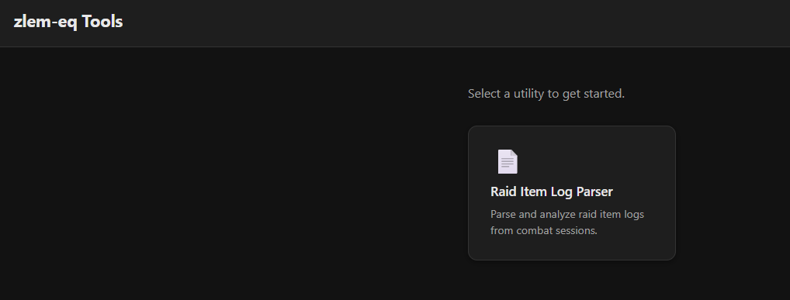

Upload your EQ log file
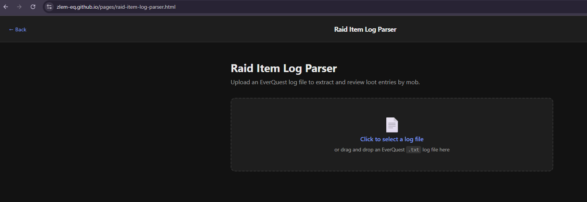

All relevant raid targets shown
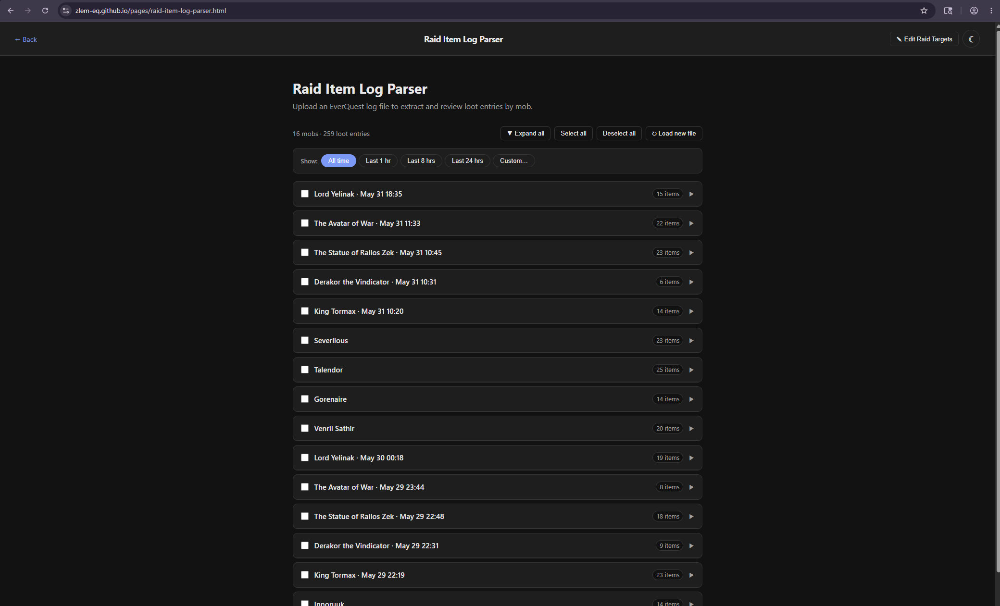

Filter list if necessary
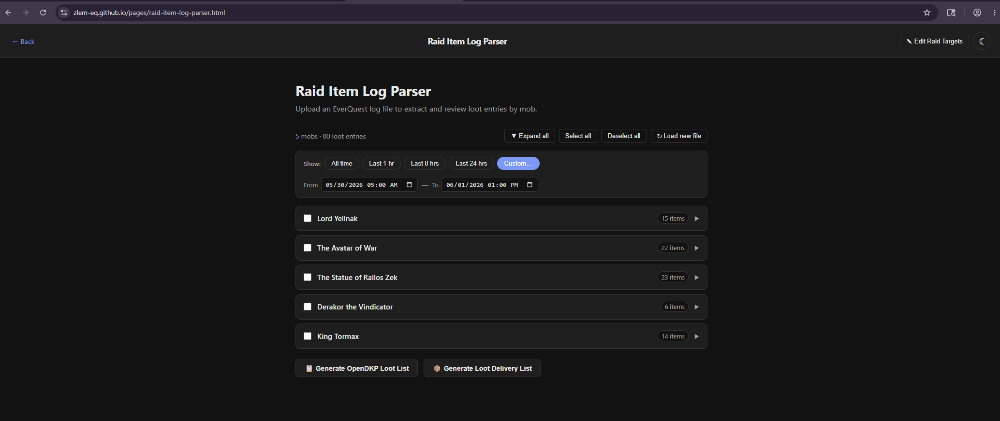

Select raid targets and loot for bidding
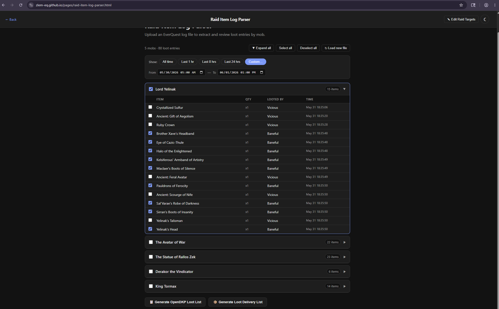

Click Generate OpenDKP Loot List button and copy the loot list string
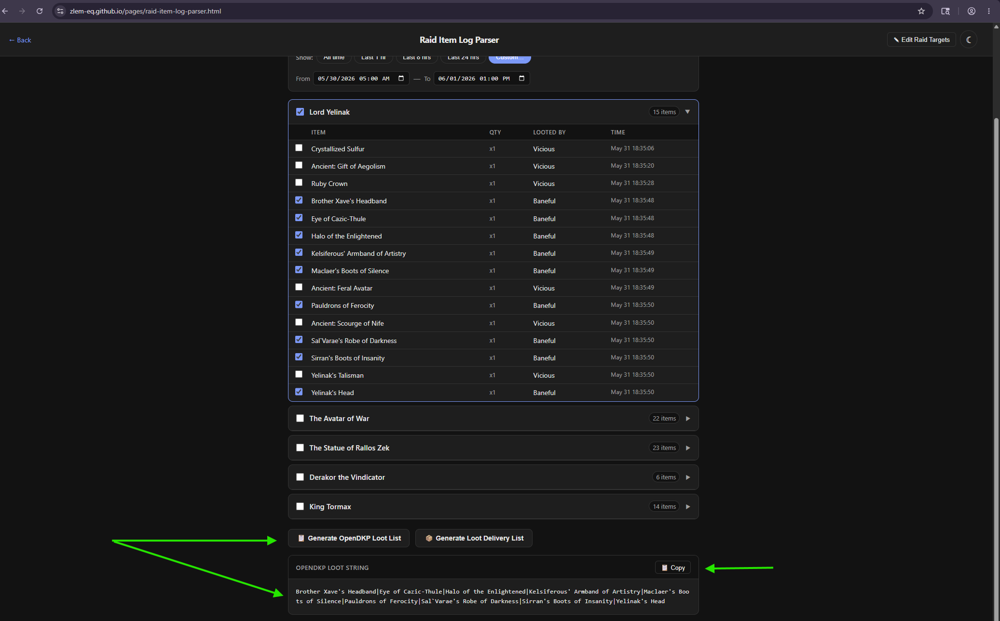

Paste the loot list string into OpenDKP bidding tool
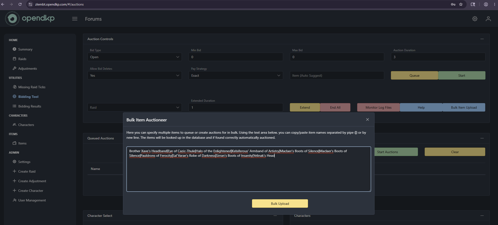

Note that duplicate items update the quantity properly
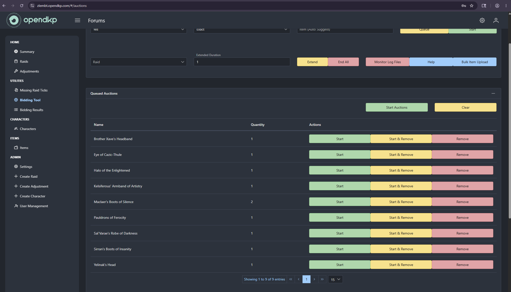

Select the items from bidding results and generate log and copy it
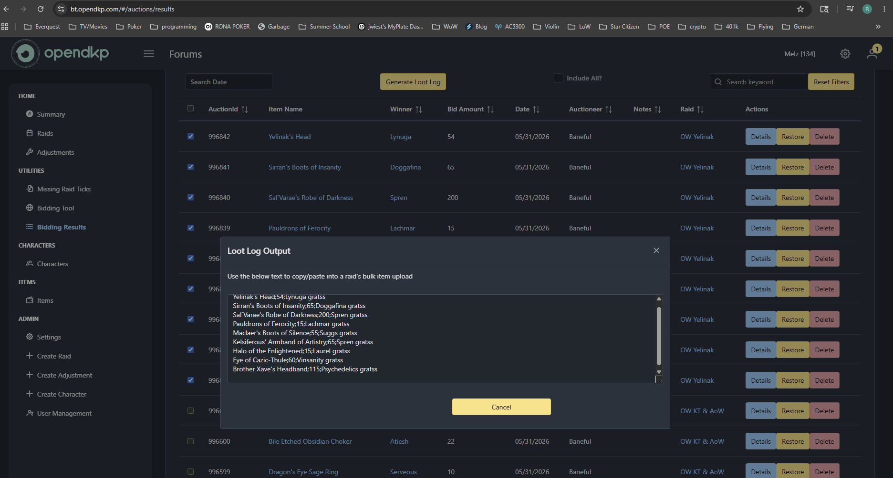

Click the Generate Loot Delivery List button and paste the bidding results, then click generate
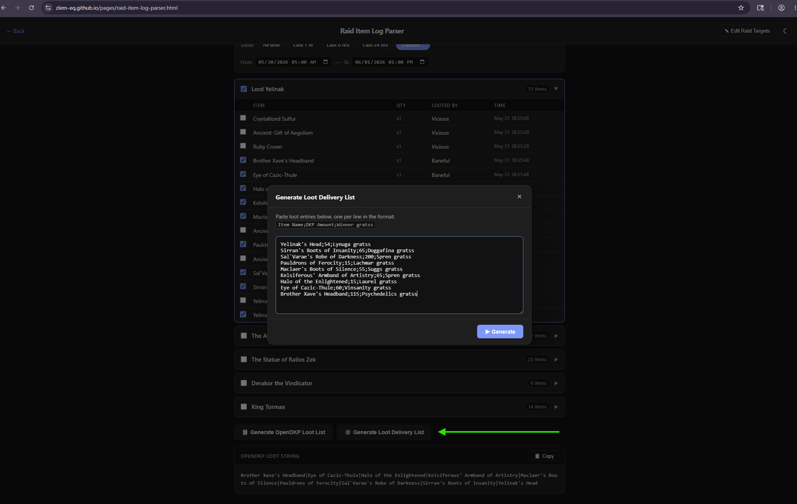

Copy the delivery instructions and post in discord
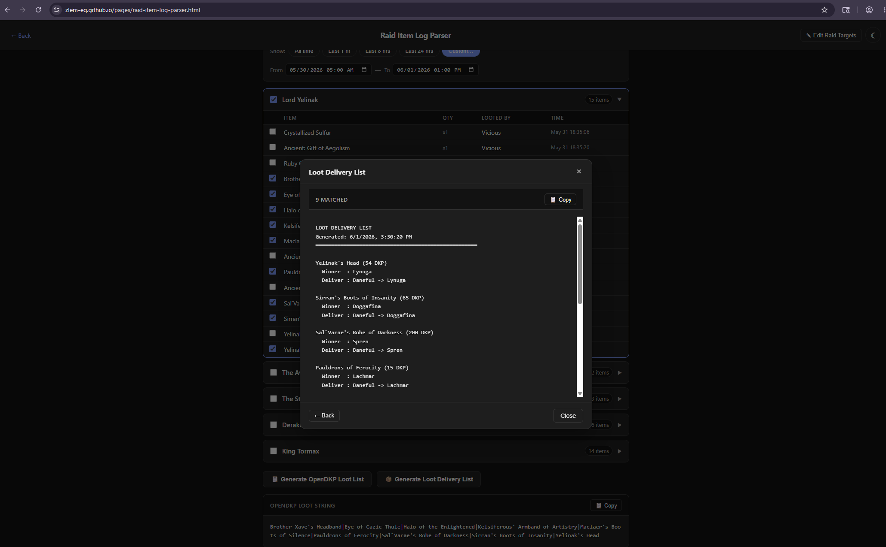
